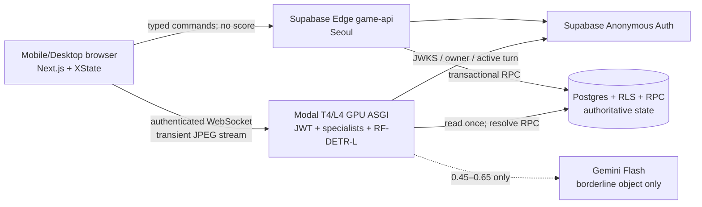

# Camera Quest architecture

## System boundary



The browser owns presentation, camera lifecycle, ROI capture, and the visible timer. XState is the only client game-flow state. PostgreSQL owns quest selection, server deadline, score, XP, level, streak, achievements, and idempotency. Modal owns calibration and vision validation, but cannot choose the quest from client input.

No browser ML runtime ships in production. `LocalGameRepository` and the force-success controls are selected only in explicit development mode.

## Turn sequence

```mermaid
sequenceDiagram
  actor P as Player
  participant B as Browser/XState
  participant V as Modal GPU ASGI
  participant E as Supabase game-api
  participant D as Postgres RPC

  P->>B: Бэлэн
  B->>V: /v1/calibrate + 5 neutral frames
  V->>V: fixed batch 5 object scan
  V-->>B: signed calibration token + baseline
  B->>E: prepare-turn
  E->>D: select non-repeated quest + insert prepared turn
  D-->>B: turnId + quest
  B->>B: reveal then 3–2–1
  B->>E: activate-turn
  E->>D: lock row; set server deadline +30s
  D-->>B: startedAt + deadlineAt + serverNow
  B->>V: open /v1/stream; authenticate + turnId + calibration token
  V->>D: verify owner and load active turn/config once
  loop one streamed batch in flight
    B->>V: sequenceNo then 5 frames as each JPEG is encoded
    V->>V: specialist early consensus or local RF-DETR batch
    alt continue
      V->>D: record metadata-only attempt
      V-->>B: progress + normalized boxes
    else pass
      V->>D: resolve_turn under row lock
      D-->>V: score/XP/level/streak/achievements
      V-->>B: authoritative pass outcome
    else system error
      V->>D: abort_turn
      V-->>B: penalty-free replay signal
    end
  end
```

The visible countdown derives from `deadlineAt + serverClockOffset`, not an incrementing React timer. Background tab throttling therefore does not pause the turn. `resolve_turn` locks the turn and returns the existing result if the same pass arrives twice.

## Code layout and dependency direction

```text
src/app → feature UI → feature application → domain
                         ↓
                    repository interface
                         ↓
             Supabase or local-dev adapter

camera → raw MediaStream + full visible frame + streamed 512px JPEG samples
vision → generated OpenAPI types + runtime Zod validation
progression → display-only achievement/level formatting
```

- `src/features/game/domain`: pure rules and types; no React, network, or storage.
- `src/features/game/application`: XState machine and use cases.
- `src/features/game/infrastructure`: command API and repository adapters.
- `src/features/game/ui`: preserved screens and visual components; they only render and forward input.
- `src/features/camera`: camera and frame capture; it never scores or stores images.
- `src/features/vision`: persistent WebSocket transport with HTTP fallback, DTO validation,
  overlays, and one-in-flight loop.
- `supabase/migrations`: authoritative data and transaction boundary.
- `vision-service/app/validators`: interchangeable specialist validators behind one interface.

Direct imports are intentional. Do not add barrel files or duplicate Supabase server state into another client store.

## Data and security invariants

- Anonymous Supabase `auth.uid()` owns every local profile and game. All user-facing tables have RLS.
- Browser roles can call command RPCs but cannot execute `resolve_turn`, `record_vision_attempt`, or `abort_turn`.
- Modal verifies JWT signature through Supabase JWKS, issuer, audience, and that `sub` equals the game owner.
- Vision validates the database quest/config; target, score, model version, and deadline are never trusted from browser fields.
- `vision_attempts` stores latency/confidence/decision/reason only. No bytea, URL, frame, or image column exists.
- Non-pass attempt telemetry is queued with Modal `.spawn()` so its idempotent Supabase RPC does
  not delay the verdict. Pass resolution, deadline checks, score, XP, and abort remain synchronous.
- Stream authentication sends the access token in the first WebSocket message, never in the URL;
  browser `Origin` must match the allowlist. The active turn/config is cached only for that socket,
  while deadline and transactional resolution remain authoritative.
- Frame batches are five 512×512 JPEGs, each capped at 300 KB and the batch capped at 1.5 MiB.
- Calibration tokens are HMAC-signed, owner-bound, and expire after 10 minutes.
- Sequence numbers have container-fast replay/rate checks and a database unique key as the global guard.
- If Sentry is enabled, its scrubbers delete request bodies/cookies and filter image/frame-like
  fields on both Next.js and Python. Empty DSNs keep observability disabled without changing game
  behavior.
- A turn with zero successful vision attempts gets one penalty-free replay. Retry state propagates to the replacement turn so it cannot loop forever.

## Add a quest using an existing validator

1. Add a new migration that inserts a `quests` row. Do not edit an already-deployed seed migration.
2. Use one of `object`, `fingers`, `smile`, or `color`, a valid difficulty, and validator config matching that validator.
3. Ensure each difficulty has enough active quests for five rounds without repeating per player.
4. Add domain fixture only if local/E2E mode needs the quest.
5. Run DB reset, pgTAP, contract generation, frontend tests, and live accuracy trials.

Threshold changes belong in `validator_config`; they should not require a frontend or Python code deploy.
Finger quests additionally accept `minPalmSpan`, `minHandednessConfidence`, and `minFingerReach`
quality gates. The defaults reject tiny, cropped, uncertain, or geometrically folded hands before
4-of-5 consensus. World-space joint angles and image-space fingertip reach must both agree, and the
four matching frames keep the same MediaPipe handedness. Specialist quests may finish after four
unanimous frames because a fifth frame cannot reverse an already-satisfied 4-of-5 result.

## Add a validator kind

1. Implement `Validator` from `vision-service/app/validators/base.py`; keep consensus deterministic and return normalized detections.
2. Register it in `vision-service/app/services.py` and add unit tests with synthetic/public fixtures.
3. Add the kind to the Postgres enum/quest constraint, Python `QuestConfig`, TypeScript `ChallengeKind`, and runtime Zod schema through migrations/contracts.
4. Regenerate FastAPI OpenAPI and TypeScript types. Never edit `src/generated/vision-api.ts` by hand.
5. Add calibration claims only when the validator truly needs a neutral baseline.
6. Run false-pass/true-pass release trials and record a new validator version on resolved turns.

## Add an achievement

1. Insert immutable metadata in a new migration.
2. Add the authoritative predicate to `unlock_achievements`; use cumulative stats or the locked game/profile row, never client claims.
3. Add the display name to `achievementPresentation.ts`.
4. Add pgTAP cases for unlock threshold, duplicate unlock, and ownership.

## Generated contracts

FastAPI generates `vision-service/openapi.json`; `openapi-typescript` generates `src/generated/vision-api.ts`. Supabase generates `src/generated/database.types.ts`. `npm run check:contracts` detects committed JSON/TypeScript and migration hash drift. CI separately runs `generate_openapi.py --check`, closing the Python → OpenAPI side of the chain.

## Failure policy

- Camera denied: no turn starts; show retry and permission help.
- Vision/GPU/Gemini exception: abort, do not reset streak, and replay the same player.
- Gemini failure: treat it as `continue`; RF-DETR remains primary.
- Browser timeout: call `expire_turn`; respect positive `remainingMs` if its clock was early.
- Modal outage before a valid attempt: one penalty-free retry. Sustained outage should disable new games with `VISION_ENABLED` operationally.
- Duplicate network delivery: SQL row lock and existing result make scoring idempotent.
